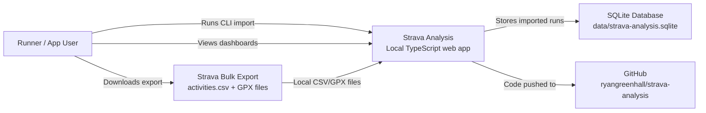
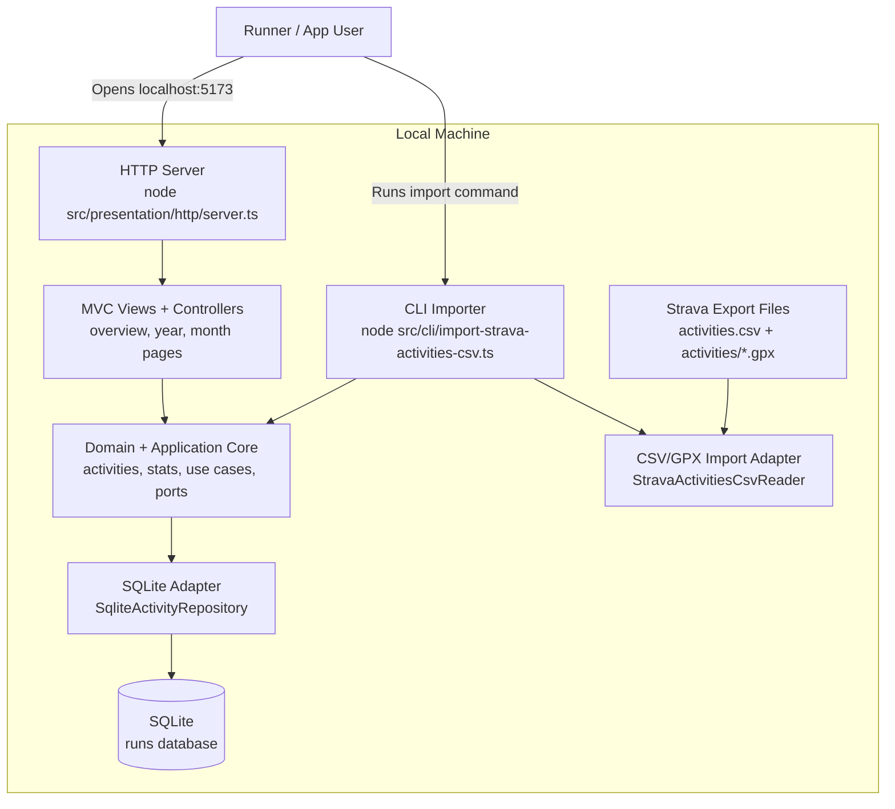
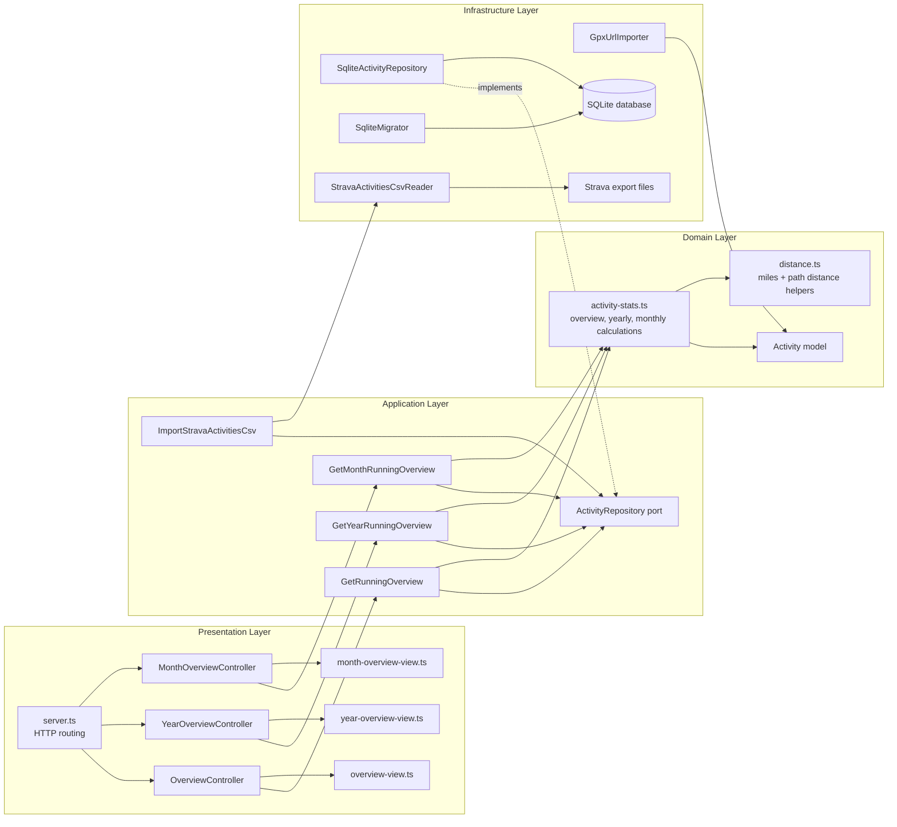

# Strava Analysis Architecture

This project follows a small hexagonal architecture with a command-line import path, a SQLite persistence adapter, and server-rendered MVC pages.

## C4 Level 1: System Context

## C4 Level 2: Container View

## C4 Level 3: Component View

## Key Architectural Choices

- **Hexagonal style:** application use cases depend on ports, not concrete storage or import mechanisms.
- **Clear domain model:** `Activity` and activity statistics are kept in `src/domain`.
- **MVC web layer:** HTTP controllers select use cases and views render HTML.
- **Database migrations:** SQL migrations live in `migrations/` and are applied by `SqliteMigrator`.
- **CLI import path:** Strava bulk export data is imported through `src/cli/import-strava-activities-csv.ts`.
